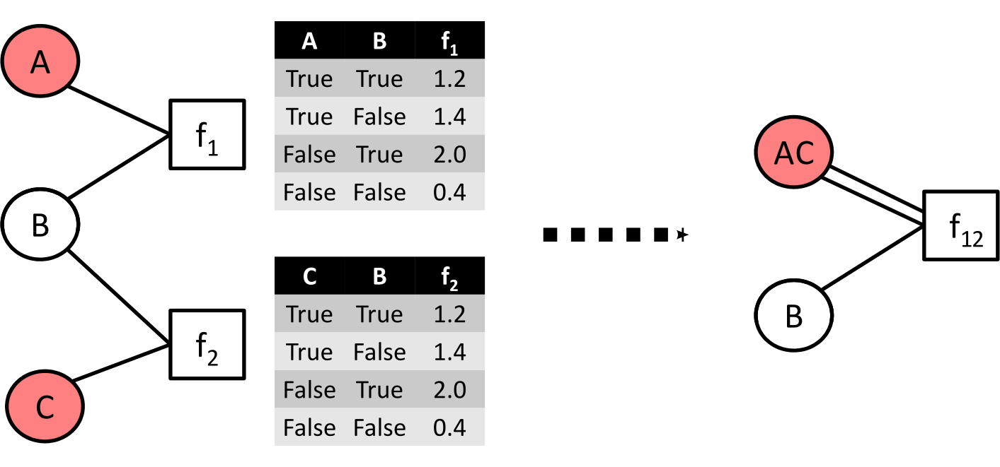

.. _tutorial:
.. highlight:: python

Tutorial
========

TODO: intro

.. contents:: Contents
	:depth: 3
	:local:

Relational Linear Programming
-----------------------------

Mathematical programs (MPs) are often specified using algebraic modelling languages such as AMPL. They simplify MP definition by allowing to use algebraic
notation instead of matrices and define an objective and constraints through parameters whose domains are defined in a separate file,
thus enabling separating the model from its instances. That is, algebraic modeling languages such as AMPL allow one to write down the problem description
in a declarative way. They free the user from engineering instance specific MPs while capturing the general properties of the problem class at hand.
However, they do not provide logically parameterized definitions for the arithmetic expressions and for the index sets. RAMPL, which we will introduce now,
feature exactly this.

Let's consider a traffic flow problem, i.e., we are given a transportation network consisting of a source (S), sink (T), and
intermediate nodes connected with links of certain capacity. For example, consider the following network. 

.. figure:: images/flownetwork.svg
   :scale: 45 %
   :alt: transportation network
   :align: center

   Transportation network for the flow LP. Numbers indicate capacities of the links.

Our task is to find a way to route as much goods from the source to the sink as the network allows. One popular way to do this is using a linear program. Let us briefly describe what an LP for the max flow problem could look like. The first step to a linear programming model of the flow problem is to assign a continuous variable to each edge in the network. Our intention is that in the LP solution, these variables will hold the amount of goods flowing on the edges. In order to get an admissible flow, however, we need to constrain these variables. Clearly, the amount of goods flowing on an edge must not exceed its capacity. This is a linear constraint on the flow variables. Another linear constraint is that a flow must be nonnegative (by convention). Finally, we have to need to introduce flow conservation: the amount of goods flowing in each node must be equal to the amount of goods flowing out (except for the source and sink nodes). The LP we end up with is as follows:

.. math::
   \operatorname*{maximize}\limits_{{\bf f} \in \mathbb{R}^{|E|}}  &\quad \sum_{v: (s,v)\in E} f_{sv} \\
             \text{s.t.} &\quad \forall v\in V\setminus \{s, t\} : \sum\nolimits_{u: (u,v) \in E} f_{uv} = \sum\nolimits_{u: (v,u) \in E} f_{vu} \;,\\
             & \quad \forall e \in E: \quad 0 \leq f_e \leq c_e\;.

To add structure to this LP, let us make the following definitions:

.. math::
       \operatorname*{inFlow}(X) := \sum\nolimits_{u: (u,X) \in E} f_{uX}\; ,\\
       \operatorname*{outFlow}(X) := \sum\nolimits_{u: (X,u) \in E} f_{Xu}\;.\\

We thus end up with:

.. math::
   \operatorname*{maximize}\limits_{{\bf f} \in \mathbb{R}^{|E|}}  &\quad \sum_{v: (s,v)\in E} f_{sv} \\
             \text{s.t.} &\quad \forall v\in V\setminus \{s, t\} : \operatorname*{inFlow}(v) = \operatorname*{outFlow}(v)\;,\\
             & \quad \forall e \in E: \quad 0 \leq f_e \leq c_e\;.

We will now show how to use reloop's RLP language to construct and solve this model.

A Relational Linear Program for Maximum Flow: Modelling in Operator Notation
****************************************************************************
(The running code for this example can be found in :ref:`maxflow_operator.py<maxflowOperator>`.)

The start of your file will import reloop’s functions for use in your code::

    from reloop.languages.rlp import *    

A variable called model (although its name is not important) is created using the reloopProblem function. It has two parameters, the first being the
arbitrary name of this problem (as a string), and the second parameter being either LpMinimize or LpMaximize depending on the type of LP we are trying to solve: ::

    model = reloopProblem("flow LP", lp.LpMaximize)

Before we start defining constraints, we will declare our predicates. In this case we have 2 of them: ``flow`` -- our variable predicate, and ``cap``, which stores the capacities of the edges. We declare them as follows ::

    flow = model.predicate("flow", 2, var = True)
    cap = model.predicate("cap", 2)

The function ``predicate()`` takes as arguments the predicate name, the arity and optionally whether the predicate is an LP variable (by default assumed false). 

We will now illustrate the concept of substitutions to define ``outFlow`` and ``inFlow``. A substitution is essentially a preprocessor instruction to replace one piece of text with another. In particular we want the atoms ``inFlow`` and ``outFlow`` to always be replaced by the sums defined above. We first declare the two predicates as substitutions ::

    inFlow = Substitution("inFlow", 1)
    outFlow = Substitution("outFlow", 1)

Next we define them ::

    outFlow <<= [ "X", psum("Y in edge(X,Y)", flow("X","Y")) ]
    inFlow  <<= [ "Y", psum("X in edge(X,Y)", flow('X','Y')) ]

where the definition takes a list of a varlist and expression. In essence, the above is roughly equivalent to the C directive

.. code-block:: c

	#define outFlow(X) psum("Y in edge(X,Y)", flow("X","Y"))

I.e., whenever something like ``outFlow(A)`` is encountered in our model, ``A`` will be bound to ``X`` and ``outFlow(A)`` will be replaced by ``psum("Y in edge(A,Y)", flow("A","Y"))``. Substitutions with multiple variables are also possible.    

Now we start collecting our model specification in the ``model`` variable using the += operator.
We start with our objective, namely that the flow out of the source node must be maximized. We specify that using the ``pobj()`` function, which takes an arithmetic expression as argument ::

    model += pobj(psum("X, Y in source(X) & edge(X,Y)", flow("X","Y")))
    
This says that we want to sum all ``flow(X,Y)`` terms for which ``X`` is a source node and there is an edge between ``X`` and ``Y``.  

Next, we encode the preservation of in- and outflows for all nodes that are not the source resp. target nodes: ::

    model += pall("Z in node(Z) & ~source(Z) & ~target(Z)", inFlow("Z") == outFlow("Z"))

The function ``pall()`` (i.e. forall) takes a query and parequation as argument. It instantiates a ground constraint for every variable in the answer of the query. 
This constraint says that except for the entrance and exit, the flow into each intersection
equals the flow out. Note that we have made use of negation in the query of the forall quantification using ~. 

Next, the capacity and traffic load are defined for each link: ::

	model += pall("X,Y in edge(X,Y)", flow("X","Y") <= cap("X","Y") )

Again, we have used cap/2 to refer to the corresponding values. The relational constraint introduces upper bounds for
all flow/2 variables. Finally, we include also the lower bounds: ::

	model += pall("X,Y in edge(X,Y)", flow("X","Y") >= 0)

Now that all the model is specified, we still have to add the definitions of the logical predicates and parameters. When we have done this, we could print the induced
LP using the "print model". We could even use the writeLP() to copy this information into a .lp file into the directory
that your code-block is running from. Once your code runs successfully, you can open this .lp file with a text editor to see what the above steps were doing.

This allows one to express LPs relationally for a varying number of individuals and relations among them without enumerating them.
Together with a logical knowledge base, effectively a logical program consisting of logical facts and rules, it induces a ground LP as we will show next.

A Logical Knowledge Base for the Flow RLP
*****************************************

Fist we define the node/1 predicate, i.e., the set of nodes in the flow network. To do so, we use pyDatalog and its decorator: ::

    @pyDatalog.predicate()
    def node1(X):
        yield('a')
        yield('b')
        yield('c')
        yield('d')
        yield('e')
        yield('f')
        yield('g')

In the same way we next define the links resp. edges of the traffic networks as well as the source and target nodes resp. intersections ::

    @pyDatalog.predicate()
    def edge2(X,Y):
        yield('a','b')
        yield('a','c')
        yield('b','d')
        yield('b','e')
        yield('c','d')
        yield('c','f')
        yield('d','e')
        yield('d','f')
        yield('e','g')
        yield('f','g')

    @pyDatalog.predicate()
    def source1(X):
        yield('a')

    @pyDatalog.predicate()
    def target1(X):
        yield('g')

Finally, we still habe to define the capacities of all links. To so so, we specify the cost(X,Y,Z) predicate econcoding
costs(X,Y)=Z: ::

    @pyDatalog.predicate()
    def cap3(X,Y,Z):
        yield('a','b',50)
        yield('a','c',100)
        yield('b','d',40)
        yield('b','e',20)
        yield('c','d',60)
        yield('c','f',20)
        yield('d','e',50)
        yield('d','f',60)
        yield('e','g',70)
        yield('f','g',70)

Solving Instances of Relational Flow LP
***************************************

To obtain the solution to this instance of the relational flow linear program, we could just call the solve() function.
It calls PuLP' solver. Since everything is embedded within Python, we could also use Python to process
the solution even further: ::

    model.solve()

    print "The model has been solved: " + model.status()

    sol =  model.getSolution()

    print "The solutions for the flow variables are:\n"
    for key, value in sol.iteritems():
        if "flow" in key and value > 0:
            print key+" = "+str(value)

    total = 0
    for key, value in sol.iteritems():
        if "flow" in key and value > 0:
            total += value

    print "\nThus, the maximum flow entering the traffic network at node a is "+str(sol["flow('a','b')"]+sol["flow('a','c')"])+" cars per hour."
    print "\nThe total flow in the traffic network is "+str(total)+" cars per hour."

This produces the following output: ::

    The model has been solved: Optimal
    The solutions for the flow variables are:

	flow(b,e) = 20.0
	flow(d,f) = 40.0
	flow(f,g) = 60.0
	flow(c,f) = 20.0
	flow(a,b) = 50.0
	flow(c,d) = 60.0
	flow(e,g) = 70.0
	flow(a,c) = 80.0
	flow(b,d) = 30.0
	flow(d,e) = 50.0

    Thus, the maximum flow entering the traffic network at node a is 130.0 cars per hour.

    The total flow in the traffic network is 480.0 cars per hour.

Of course, changing the knowledge base will result in different solutions. The corresponding .lp file (produced e.g. by PuLP) would look like this: ::

	flow LP:
	MAXIMIZE
	1.0*flow(a,b) + 1.0*flow(a,c) + 0
	SUBJECT TO
	_C1: flow(c,f) + flow(d,f) - flow(f,g) = 0
	_C2: flow(b,d) + flow(c,d) - flow(d,e) - flow(d,f) = 0
	_C3: flow(a,b) - flow(b,d) - flow(b,e) = 0
	_C4: flow(b,e) + flow(d,e) - flow(e,g) = 0
	_C5: flow(a,c) - flow(c,d) - flow(c,f) = 0
	_C6: flow(e,g) <= 70
	_C7: flow(c,d) <= 60
	_C8: flow(c,f) <= 20
	_C9: flow(a,b) <= 50
	_C10: flow(f,g) <= 70
	_C11: flow(b,e) <= 20
	_C12: flow(a,c) <= 100
	_C13: flow(d,f) <= 60
	_C14: flow(b,d) <= 40
	_C15: flow(d,e) <= 50
	_C16: flow(d,e) >= 0
	_C17: flow(e,g) >= 0
	_C18: flow(a,b) >= 0
	_C19: flow(b,e) >= 0
	_C20: flow(c,f) >= 0
	_C21: flow(f,g) >= 0
	_C22: flow(a,c) >= 0
	_C23: flow(b,d) >= 0
	_C24: flow(d,f) >= 0
	_C25: flow(c,d) >= 0

	VARIABLES
	flow(a,b) free Continuous
	flow(a,c) free Continuous
	flow(b,d) free Continuous
	flow(b,e) free Continuous
	flow(c,d) free Continuous
	flow(c,f) free Continuous
	flow(d,e) free Continuous
	flow(d,f) free Continuous
	flow(e,g) free Continuous
	flow(f,g) free Continuous

The complete running example can be found :ref:`here<maxflowOperator>`.

Modeling in Text Notation 
****************************************************************************

The RLP envirnonment allows the user to also enter the equations in text form, as introduced in (TODO: paper).
To illustrate, we will show how the flow LP looks like in text form :: 

	model = reloopProblem("flow LP", lp.LpMaximize)

	# declarations
	model.predicate("flow", 2, var = True)
	model.predicate("cap", 2)
	model.predicate("inFlow", 1, var = True)
	model.predicate("outFlow", 1, var = True)
	# the objective function is added to relational LP first
	model += reloopConstraint("sum{ X,Y in source(X) & edge(X,Y) } : { flow(X,Y) }")
	# constraints defining inflow are added
	input = "forall{ Y in node(Y) & ~source(Y) } : { sum{ X in edge(X,Y) } : { 1.0*flow(X,Y)} = inFlow(Y)}"
	model += reloopConstraint(input)
	# constraints defining outflow are added
	input = "forall{ X in node(X) & ~target(X) } : { sum{ Y in edge(X,Y) } : { 1.0*flow(X,Y) }  = outFlow(X)}"
	model += reloopConstraint(input)
	# constraints defining preservation of flow are added
	input = "forall{ X in node(X) & ~source(X) & ~target(X)} : { inFlow(X) = outFlow(X) }"
	model += reloopConstraint(input)
	# constraints defining lower and upper bounds are added
	input = "forall{ X,Y in edge(X,Y) } : { flow(X,Y) >= 0}"
	model += reloopConstraint(input)
	input = "forall{ X,Y in edge(X,Y) } : { flow(X,Y) <= cap(X,Y)}"
	model += reloopConstraint(input)

You can find the running code in :ref:`maxflow_text.py<maxflowText>`. 

.. CAUTION::
    Substitutions are not yet implemented in text mode. As you can see, we have implemented ``inFlow`` and ``outFlow`` as LP variables and their definitions as LP constraints.

Equitable Partitions and Lifted Linear Programming
--------------------------------------------------

Next to modeling languages, reloop offers tools for efficiently lifting and solving optimization problems produced by these languages (and not only). In the lifted solvers provided, efficiency is gained by exploiting redundancy in the structure of the problem. Our main tool for redundancy discovery are the so-called equitable partitions of matrices. In the following, we will look at computing equitable partitions of matrices with the tools of reloop, as well as  lifting factor graphs, solving linear equations and linear programs in a lifted fashion.   

Equitable Partitions of Matrices
********************************

Given is a tuple :math:`L=(\mathbf{A},\mathbf{b},\mathbf{c})`, where :math:`\mathbf{A}\in \mathbb{R}^{m\times n}, \mathbf{b}\in \mathbb{R}^{m}` and :math:`\mathbf{c}\in \mathbb{R}^{n}`. We say that a partition :math:`{\cal P} = \{P_1,\ldots,P_p; Q_1,\ldots,Q_q\}` of :math:`L=(\mathbf{A},\mathbf{b},\mathbf{c})` is **equitable** if the following conditions hold. 

* For any two columns :math:`i,\; j` in the same class :math:`P`, :math:`\mathbf{c}_i = \mathbf{c}_j`. For any two rows :math:`i,\; j` in the same class :math:`Q`, :math:`\mathbf{b}_i = \mathbf{b}_j`;

* For any two columns :math:`i,\; j` in the same class :math:`P`, and for any constraint class :math:`Q` and real number :math:`r`: 

.. math::
    |\{k \in Q\ :\ \mathbf{A}_{ik} = r \}| = |\{l \in Q\ :\ \mathbf{A}_{jl} = r \}|\;.

* Analogously,  for any two rows :math:`i,\; j` in the same class :math:`Q`, and for any constraint class :math:`P` and real number :math:`r`:

.. math::
    |\{k \in P :\ \mathbf{A}_{ki} = r \}| = |\{l \in P :\ \mathbf{A}_{lj} = r \}|\;.

Reloop provides an interface to the highly efficient code of `Saucy <http://vlsicad.eecs.umich.edu/BK/SAUCY/>`_ for the computation of equitable partitions of matrices. Currently, we can compute the coarsest equitable partition of a matrix, as well as its orbit partition. We will now show how to compute equitable partitions. We will now illustrate the basic concepts by lifting a factor graph so we can later run lifted belief propagation. 

Lifting an MRF Factor Graph
***************************

Suppose we are given the following factor graph (to the right).  

We have two factors with identical tables, two observed variables (:math:`A` and :math:`B`) and one unobserved variable. Our aim is to compute a lifted factor graph (on the right) so we can run lifted belief propagation. We will now show how this is done in reloop.

We begin by importing the Saucy wrapper from reloop ::

    import reloop.utils.saucy as saucy

We will also need ``scipy.sparse`` and ``numpy``: ::

    import scipy.sparse as sp
    import numpy as np

Now we must figure out how to represent our factor graph in a way that Saucy can understand. Let us make a few observations. 

First, it is a bipartite graph. This suggest that we can encode it in a rectangular matrix, where the rows represent factors and the columns represent variables. I.e., we have :math:`\mathbf{A}_{fX} \neq 0` if variable :math:`X` is connected to factor :math:`f` and :math:`\mathbf{A}_{fX} = 0` otherwise. Now we need to figure out what the actual entry for an edge would be. The subtlety lies in the fact that our factor tables are not symmetric: :math:`f_1(A = \mathrm{True}, B = \mathrm{False}) \neq f_1(A = \mathrm{False}, B = \mathrm{True})`. In other words, the first and second positions of the factor are not exchangeable. To reflect this in the representation, we will set :math:`\mathbf{A}_{fX} = 1` if :math:`X` is connected to the first position of :math:`f` and :math:`2` if it is in the second position. Since these numbers are internally intepreted as colors, the actual choice of numbers is not important, as long as compatible positions (arguments of the factor that can be permuted) receive the same numbers, and incompatible positions receive different numbers.

Second, two of the variables are observced, one is not. We do not want to group observed and unobserved variables, so we need to distinguish them. We can do so by using the :math:`\mathbf{c}`-vector (depending on the possible states that the variables can take, we may need to use even more colors --- this depends on the MRF; for now we assume they are binary), assigning a different value for :math:`B`. Also, in this case our two factor tables are identical, but were they different, we would need to prevent the factors for being grouped together. We could accomplish this in the same manner, by using the :math:`\mathbf{b}`-vector.

We thus end up with the following representation of the factor graph:

.. math::

      \mathbf{A}^F = \begin{bmatrix}
           1 & 2 & 0           \\[0.3em]
           0 & 2 & 1            \\[0.3em]
           \end{bmatrix}\;,
        \mathbf{b}^F = \begin{bmatrix}
       0\\
       0\\
     \end{bmatrix} \text{ and } \mathbf{c}^F =       \begin{bmatrix}
       1\\
       0\\
       1\\
     \end{bmatrix}\; . 

We can now input this in saucy. All our data needs to be in coo_matrix format, and ``b`` and ``c`` must be column vectors:  ::

    A = sp.coo_matrix([[1, 2, 0], [0, 2, 1]])
    b = sp.coo_matrix([0,0]).T
    c = sp.coo_matrix([1,0,1]).T

We can now call the equitable partition function and print the result: ::

    [rowpart, colpart] = saucy.epBipartite(A, b, c, 1)
    print "==="
    print "row classes: ", rowpart
    print "column classes: ", colpart 

Note that the ``1`` in the last argument of ``epBipartite()`` indicates we are computing the coarsest equitable partition. To compute orbits, we use ``0``.
When ran, this python code (also found at :ref:`lift_factorgraph.py<epFg>`) outputs the following: ::

    entring wrapper with 2 rows, 3 cols and 4 entries.
    row colors: 1
    col colors: 3
    nodes 9
    edges 8
    input file = (null)
    vertices = 9
    edges = 8
    group size = 1.000000e0
    levels = 0
    nodes = 1
    generators = 0
    total support = 0
    average support = -nan
    nodes per generator = inf
    bad nodes = 0
    cpu time (s) = 0.00
    ===
    row classes:  [0 0]
    column classes:  [1 0 1]

After the debug output of Saucy we can read off the partition. For the variable (column classes)  :math:`A` and :math:`C` are placed in class :math:`1`, while :math:`B` is placed in class :math:`0`. Also, both factors (row classes) are in the same class. This is exactly what we expected from the example. 

The actual lifted factor graph construction having the colors follows as in (TODO: Babak's paper).

Note that the actual numbering of the classes is not guaranteed to follow any particular convention. 

Lifting Linear Programs
********************************

Let us consider the following LP:

.. math::
    \operatorname*{minimize}_{[x,y,z]^T \in \mathbb{R}^3}\quad  &\; 0x + 0y + 1z\\ 
    \text{subject to}\quad & \begin{bmatrix}
       1 & 1 & 1           \\[0.3em]
       -1 & 0 & 0            \\[0.3em]
       0 & -1 & 0            \\[0.3em]
       1 & 1 & -1            \\[0.3em]
     \end{bmatrix} 
      \begin{bmatrix}
       x\\
       y\\
       z\\
     \end{bmatrix} \leq 
           \begin{bmatrix}
       1\\
       0\\
       0\\
       -1\\
     \end{bmatrix}\;.

It can be verified that an equitable partition of the above LP is :math:`{\cal P}^0 = \{\{1,2\},\{3\};\{1\}\{2,3\}\{4\} \}` --- meaning that column :math:`c_1` is equivalent to :math:`c_2` but not to :math:`c_3` and rows :math:`r_2` and :math:`r_3` are equivalent, but not rows :math:`r_1` and :math:`r_4`. Using this equitable partition, we can derive a new LP, smaller in size, whose set of solutions is a subset of the solutions of the original one. The method of this reduction is described in detail in (TODO: RLP). In short, we reduce the number of rows by leaving only one row per row-class. Then, we reduce the number of columns by removing all columns in the same class from the LP, then inserting back a single representative column which is their sum.  The lifted LP is thus 

.. math::

    \operatorname*{minimize}_{[{\mathfrak x},z]^T \in \mathbb{R}^2}\quad  &\; 0 {\mathfrak x} + 1z\\ 
    \text{subject to}\quad & \begin{bmatrix}
       2 &  1           \\[0.3em]
       -1  & 0             \\[0.3em]
       2 & -1            \\[0.3em]
     \end{bmatrix} 
      \begin{bmatrix}
      {\mathfrak x}\\
       z\\
     \end{bmatrix} \leq 
           \begin{bmatrix}
       1\\
       0\\
       -1\\
     \end{bmatrix}\;.

Within reloop, lifting LPs is achieved through the ``utils.liftAbc()`` function. The following code snippet shows how. ::

    A = sp.coo_matrix([[1, 1, 1], [-1, 0, 0], [0, -1, 0], [1, 1, -1]])
    b = sp.coo_matrix([1,0,0,-1]).T
    c = sp.coo_matrix([0,0,1]).T

    print "input LP:"
    print "c: " + str(c.todense().T)
    print "b: " + str(b.todense())
    print "A: " + str(A.todense())

    LA, Lb, Lc, compresstime, Bcc = saucy.liftAbc(A, b, c, sparse=True, orbits=False)

    print "lifted LP:"
    print "lifted c: " + str(Lc.T)
    print "Lb: " + str(Lb)
    print "LA: " + str(LA.todense())

(TODO: fix sparsity of b and c)
The minimal working example is found at :ref:`lift_Abc.py<liftAbc>`. Executing this code yields ::

    input LP:
    c: [[0 0 1]]
    b: [[ 1]
     [ 0]
     [ 0]
     [-1]]
    A: [[ 1  1  1]
     [-1  0  0]
     [ 0 -1  0]
     [ 1  1 -1]]
    entring wrapper with 4 rows, 3 cols and 8 entries.
    row colors: 3
    col colors: 5
    nodes 15
    edges 16
    input file = (null)
    vertices = 15
    edges = 16
    group size = 1.000000e0
    levels = 0
    nodes = 1
    generators = 0
    total support = 0
    average support = -nan
    nodes per generator = inf
    bad nodes = 0
    cpu time (s) = 0.00
    refinement took:  0.01 seconds.
    lifted LP:
    lifted c: [[0 1]]
    Lb: [[-1]
     [ 0]
     [ 1]]
    LA: [[ 2 -1]
     [-1  0]
     [ 2  1]]

We can read off the lifted LP at the bottom of the output. Note that while the LP agrees with what we expected, the order of the inequalities is different (first and third are switched). This is an artifact of the implementation. It does not, however, change the feasible region of the LP.