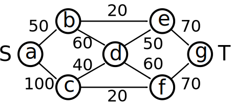

.. _tutorial:
.. highlight:: python

Tutorial
========

TODO: intro

.. contents:: Contents
	:depth: 3
	:local:

Relational Linear Programming
-----------------------------

Mathematical programs (MPs) are often specified using algebraic modelling languages such as AMPL. They simplify MP definition by allowing to use algebraic
notation instead of matrices and define an objective and constraints through parameters whose domains are defined in a separate file,
thus enabling separating the model from its instances. That is, algebraic modeling languages such as AMPL allow one to write down the problem description
in a declarative way. They free the user from engineering instance specific MPs while capturing the general properties of the problem class at hand.
However, they do not provide logically parameterized definitions for the arithmetic expressions and for the index sets. RAMPL, which we will introduce now,
feature exactly this.

Let's consider a traffic flow problem, i.e., we are given a transportation network consisting of a source (S), sink (T), and
intermediate nodes connected with links of certain capacity. For example, consider the following network. 

   Transportation network for the flow LP. Numbers indicate capacities of the links.

Our task is to find a way to route as much goods from the source to the sink as the network allows. One popular way to do this is using a linear program. Let us briefly describe what an LP for the max flow problem could look like. The first step to a linear programming model of the flow problem is to assign a continuous variable to each edge in the network. Our intention is that in the LP solution, these variables will hold the amount of goods flowing on the edges. In order to get an admissible flow, however, we need to constrain these variables. Clearly, the amount of goods flowing on an edge must not exceed its capacity. This is a linear constraint on the flow variables. Another linear constraint is that a flow must be nonnegative (by convention). Finally, we have to need to introduce flow conservation: the amount of goods flowing in each node must be equal to the amount of goods flowing out (except for the source and sink nodes). The LP we end up with is as follows:

.. math::
   \operatorname*{maximize}\limits_{{\bf f} \in \mathbb{R}^{|E|}}  &\quad \sum_{v: (s,v)\in E} f_{sv} \\
             \text{s.t.} &\quad \forall v\in V\setminus \{s, t\} : \sum\nolimits_{u: (u,v) \in E} f_{uv} = \sum\nolimits_{u: (v,u) \in E} f_{vu} \;,\\
             & \quad \forall e \in E: \quad 0 \leq f_e \leq c_e\;.

To add structure to this LP, let us make the following definitions:

.. math::
       \operatorname*{inFlow}(X) := \sum\nolimits_{u: (u,X) \in E} f_{uX}\; ,\\
       \operatorname*{outFlow}(X) := \sum\nolimits_{u: (X,u) \in E} f_{Xu}\;.\\

We thus end up with:

.. math::
   \operatorname*{maximize}\limits_{{\bf f} \in \mathbb{R}^{|E|}}  &\quad \sum_{v: (s,v)\in E} f_{sv} \\
             \text{s.t.} &\quad \forall v\in V\setminus \{s, t\} : \operatorname*{inFlow}(v) = \operatorname*{outFlow}(v)\;,\\
             & \quad \forall e \in E: \quad 0 \leq f_e \leq c_e\;.

We will now show how to use reloop's RLP language to construct and solve this model.

A Relational Linear Program for Maximum Flow: Operator Notation
***************************************************************
(This section is based on :ref:`maxflow_operator.py<maxflowOperator>`)

The start of your file will import reloop’s functions for use in your code::

    from reloop.languages.rlp import *    

A variable called model (although its name is not important) is created using the reloopProblem function. It has two parameters, the first being the
arbitrary name of this problem (as a string), and the second parameter being either LpMinimize or LpMaximize depending on the type of LP we are trying to solve: ::

    model = reloopProblem("traffic flow LP in the spirit of page 329 in http://ampl.com/BOOK/CHAPTERS/18-network.pdf", lp.LpMaximize)

Before we start defining constraints, we will declare our predicates. In this case we have 2 of them: ``flow`` -- our variable predicate, and ``cap``, which stores the capacities of the edges. We declare them as follows ::

    flow = model.predicate("flow", 2, var = True)
    cap = model.predicate("cap", 2)

The function ``predicate()`` takes as arguments the predicate name, the arity and optionally whether the predicate will be used to store the LP variables (by default assumed false). 

We will now illustrate the concept of substitutions to define ``outFlow`` and ``inFlow``. A substitution is essentially a preprocessor instruction to replace one piece of text with another. In particular we want the atoms ``inFlow`` and ``outFlow`` to always be replaced by the sums defined above. We first declare the two predicates as substitutions ::

    inFlow = Substitution("inFlow", 1)
    outFlow = Substitution("outFlow", 1)

Next we define them, ::

    outFlow <<= [ "X", psum("Y in edge(X,Y)", flow("X","Y")) ]
    inFlow  <<= [ "Y", psum("X in edge(X,Y)", flow('X','Y')) ]

Hence, whenever something like ``outFlow(A)`` is encountered in our model, ``A`` will be bound to ``X`` and ``outFlow(A)`` will be replaced by ``psum("Y in edge(A,Y)", flow("A","Y"))``.   

Now we start collecting our model specification in the ``model`` variable using the += operator.
We start with our objective, namely that the flow out of the source node must be maximized. We specify that using the ``pobj()`` function, which takes an arithmetic expression as argument ::

    model += pobj(psum("X, Y in source(X) & edge(X,Y)", flow("X","Y")))
    
This says that we want to sum all ``flow(X,Y)`` terms for which ``X`` is a source node and there is an edge between ``X`` and ``Y``.  

Next, we encode the preservation of in- and outflows for all nodes that are not the source resp. target nodes: ::

    model += pall("Z in node(Z) & ~source(Z) & ~target(Z)", inFlow("Z") == outFlow("Z"))

The function ``pall()`` (i.e. forall) takes a query and parequation as argument. It instantiates a ground constraint for every variable in the answer of the query. 
This constraint says that except for the entrance and exit, the flow into each intersection
equals the flow out. Note that we have made use of negation in the query of the forall quantification using ~. 

Next, the capacity and traffic load are defined for each link: ::

	model += pall("X,Y in edge(X,Y)", flow("X","Y") <= cap("X","Y") )

Again, we have used cap/2 to refer to the corresponding values. The relational constraint introduces upper bounds for
all flow/2 variables. Finally, we include also the lower bounds: ::

	model += pall("X,Y in edge(X,Y)", flow("X","Y") >= 0)

Now that all the model is specified, we still have to add the definitions of the logical predicates and parameters. When we have done this, we could print the induced
LP using the "print model". We could even use the writeLP() to copy this information into a .lp file into the directory
that your code-block is running from. Once your code runs successfully, you can open this .lp file with a text editor to see what the above steps were doing.

This allows one to express LPs relationally for a varying number of individuals and relations among them without enumerating them.
Together with a logical knowledge base, effectively a logical program consisting of logical facts and rules, it induces a ground LP as we will show next.

A Logical Knowledge Base for the Flow RLP
*****************************************

Fist we define the node/1 predicate, i.e., the set of nodes in the flow network. To do so, we use pyDatalog and its decorator: ::

    @pyDatalog.predicate()
    def node1(X):
        yield('a')
        yield('b')
        yield('c')
        yield('d')
        yield('e')
        yield('f')
        yield('g')

In the same way we next define the links resp. edges of the traffic networks as well as the source and target nodes resp. intersections ::

    @pyDatalog.predicate()
    def edge2(X,Y):
        yield('a','b')
        yield('a','c')
        yield('b','d')
        yield('b','e')
        yield('c','d')
        yield('c','f')
        yield('d','e')
        yield('d','f')
        yield('e','g')
        yield('f','g')

    @pyDatalog.predicate()
    def source1(X):
        yield('a')

    @pyDatalog.predicate()
    def target1(X):
        yield('g')

Finally, we still habe to define the capacities of all links. To so so, we specify the cost(X,Y,Z) predicate econcoding
costs(X,Y)=Z: ::

    @pyDatalog.predicate()
    def cap3(X,Y,Z):
        yield('a','b',50)
        yield('a','c',100)
        yield('b','d',40)
        yield('b','e',20)
        yield('c','d',60)
        yield('c','f',20)
        yield('d','e',50)
        yield('d','f',60)
        yield('e','g',70)
        yield('f','g',70)

Solving Instances of Relational Flow LP
***************************************

To obtain the solution to this instance of the relational flow linear program, we could just call the solve() function.
It calls PuLP' solver. Since everything is embedded within Python, we could also use Python to process
the solution even further: ::

    model.solve()

    print "The model has been solved: " + model.status()

    sol =  model.getSolution()

    print "The solutions for the flow variables are:\n"
    for key, value in sol.iteritems():
        if "flow" in key and value > 0:
            print key+" = "+str(value)

    total = 0
    for key, value in sol.iteritems():
        if "flow" in key and value > 0:
            total += value

    print "\nThus, the maximum flow entering the traffic network at node a is "+str(sol["flow('a','b')"]+sol["flow('a','c')"])+" cars per hour."
    print "\nThe total flow in the traffic network is "+str(total)+" cars per hour."

This produces the following output: ::

    The model has been solved: Optimal
    The solutions for the flow variables are:

	flow(b,e) = 20.0
	flow(d,f) = 40.0
	flow(f,g) = 60.0
	flow(c,f) = 20.0
	flow(a,b) = 50.0
	flow(c,d) = 60.0
	flow(e,g) = 70.0
	flow(a,c) = 80.0
	flow(b,d) = 30.0
	flow(d,e) = 50.0

    Thus, the maximum flow entering the traffic network at node a is 130.0 cars per hour.

    The total flow in the traffic network is 480.0 cars per hour.

Of course, changing the knowledge base will result in different solutions. The corresponding .lp file (produced e.g. by PuLP) would look like this: ::

	traffic flow LP in the spirit of page 329 in http://ampl.com/BOOK/CHAPTERS/18-network.pdf:
	MAXIMIZE
	1.0*flow(a,b) + 1.0*flow(a,c) + 0
	SUBJECT TO
	_C1: flow(c,f) + flow(d,f) - flow(f,g) = 0
	_C2: flow(b,d) + flow(c,d) - flow(d,e) - flow(d,f) = 0
	_C3: flow(a,b) - flow(b,d) - flow(b,e) = 0
	_C4: flow(b,e) + flow(d,e) - flow(e,g) = 0
	_C5: flow(a,c) - flow(c,d) - flow(c,f) = 0
	_C6: flow(e,g) <= 70
	_C7: flow(c,d) <= 60
	_C8: flow(c,f) <= 20
	_C9: flow(a,b) <= 50
	_C10: flow(f,g) <= 70
	_C11: flow(b,e) <= 20
	_C12: flow(a,c) <= 100
	_C13: flow(d,f) <= 60
	_C14: flow(b,d) <= 40
	_C15: flow(d,e) <= 50
	_C16: flow(d,e) >= 0
	_C17: flow(e,g) >= 0
	_C18: flow(a,b) >= 0
	_C19: flow(b,e) >= 0
	_C20: flow(c,f) >= 0
	_C21: flow(f,g) >= 0
	_C22: flow(a,c) >= 0
	_C23: flow(b,d) >= 0
	_C24: flow(d,f) >= 0
	_C25: flow(c,d) >= 0

	VARIABLES
	flow(a,b) free Continuous
	flow(a,c) free Continuous
	flow(b,d) free Continuous
	flow(b,e) free Continuous
	flow(c,d) free Continuous
	flow(c,f) free Continuous
	flow(d,e) free Continuous
	flow(d,f) free Continuous
	flow(e,g) free Continuous
	flow(f,g) free Continuous

Lifted Linear Programming
-------------------------

asdf

